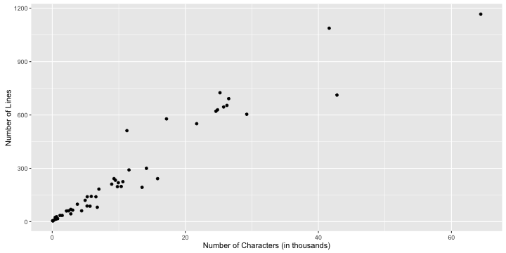
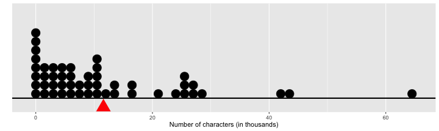
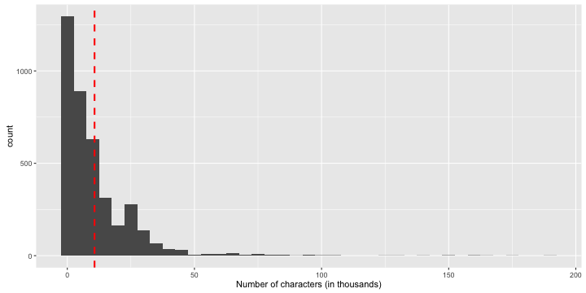
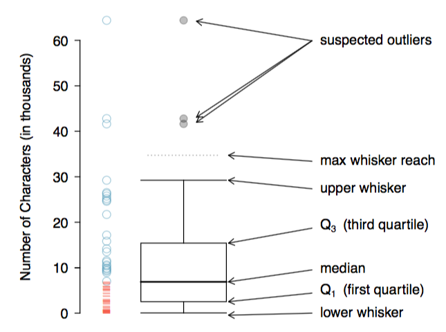
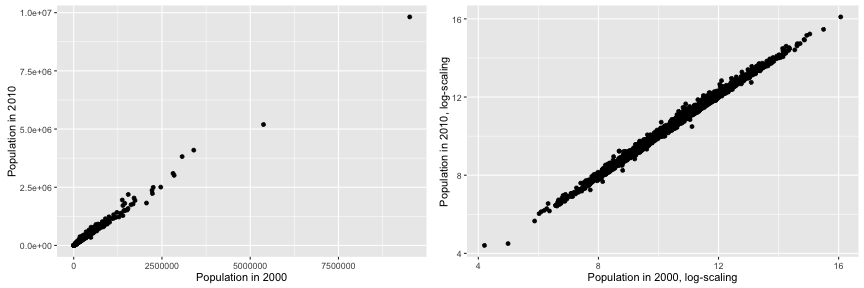
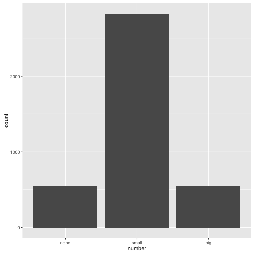

## Course Logistic

* Every Wednesday 19:00 - 21:00
* Slides: http://nikolaypavlov.github.io/da-workshops-2/
* Skype Chat: https://join.skype.com/gjN0CfAd4bhg
* Reference Book: https://www.openintro.org/stat/textbook.php
* ggplot2 Documentation: http://docs.ggplot2.org
* Install the following packages: openintro, ggplot2, grid

---
## Topics

* Objectives
* How Does a Plot Get Created? (Special topic)
* Scatterplot
* Dotplot, Distribution, Mean
* Histogram, Variance, Standard Deviation, Skew, Mode
* Box plots, quartiles, median, IQR
* Data transformation (Special topic)
* Bar plots, contingency tables, proportions

---
## Objectives of exploratory data analysis

* Get understanding of the data
* Reveal structure and patterns
* Consider some models "to try next"
* Debug

--- 
## How Does a Plot Get Created?

R creates plot on specific graphics device:

* Screen device: quartz(), windows(), x11().
* File device: PDF, PNG, JPEG, SVG...

By default plot() in base, xyplot() in lattice, or qplot() in ggplot2 use screen device.

Try help(Devices) for more information

---
## Example

1. Open PNG device
2. Create plot, send to a file
3. Annotate
4. Close device


```r
png(file = "email.png")
plot(num_char ~ line_breaks, data=email)
title(main = "Number of lines versus number of characters in email") 
dev.off()
```

```
## quartz_off_screen 
##                 2
```

---
## ggplot2 basic principles

An implementaon of the Grammar of Graphics by Leland Wilkinson

Describe a statistical plot in several consecutive steps: 
* data (data frame)
* aesthetic mappings (size, shape, color...)
* geometric objects (points, lines, polygon...)
* scales
* facet specification
* statistical transformations
* the coordinate system 

Together, the data, aes, stat transform and geom form a Layer

---
## Scatterplot


```r
library(ggplot2)
qplot(num_char, line_breaks, data=email50, geom="point",
      xlab="Number of Characters (in thousands)", ylab="Number of Lines")
```



---
## Exercise

Does the HTML format affect the size of email?

Add color or facet to prevous plot.

Useful arguments and functions: color, facets, factor(), help(qplot) 

---
## Dotplot, mean, distribution


```r
p <- ggplot(email50, mapping=aes(x=num_char)) + 
  geom_dotplot(binwidth = 1.5, method="histodot") + 
  geom_point(data=data.frame(x=mean(email50$num_char), y=-0.1), 
             aes(x, y), colour="red", size=8, shape=17) + 
  geom_hline(yintercept=0, size=1, color="black") +
  scale_x_continuous(name ="Number of characters (in thousands)") + 
  scale_y_continuous(name = "", breaks = NULL)
p
```



---
## Histogram, variance, standard deviation


```r
p <- ggplot(email, mapping=aes(x=num_char)) + 
  geom_histogram(binwidth=5) +
  geom_vline(xintercept=mean(email$num_char), linetype="dashed", colour="red", size=1) +
  scale_x_continuous(name="Number of characters (in thousands)")
p
```



---
## Box plots, quartiles, median, IQR



---
## Exercise 

### Create boxplot of the num_char var using ggplot2

* Set appropriate Y axis label
* Clean up X axis, set limits, remove breaks
* Fill box with color
* Set main title for the plot

### Get the summary statistics of the num_char var

Try summary() function


---
## Transformations (special topic)

### Reasons:

* Easy to visualize and understand
* Stat/ML algorithm requirement
* Domain standard

Some common transforms: log, square root, inverse, power (Box-Cox), z-norm, Fourier

---
## Example Log transformation


```r
library(grid)
p1 <- qplot(pop2000, pop2010, data=county, xlab="Population in 2000", ylab="Population in 2010", na.rm=T)
p2 <- qplot(log(pop2000), log(pop2010), data=county, 
            xlab="Population in 2000, log-scaling", ylab="Population in 2010, log-scaling", na.rm=T)
pushViewport(viewport(layout = grid.layout(1, 2))) 
print(p1, vp = viewport(layout.pos.row = 1, layout.pos.col = 1)) 
print(p2, vp = viewport(layout.pos.row = 1, layout.pos.col = 2)) 
```



---
## Contingency tables, proportions and bar plots

### Frequency table

```r
num_freq_table <- table(email$number)
addmargins(num_freq_table, 1)
```

```
## 
##  none small   big   Sum 
##   549  2827   545  3921
```


```r
spam_freq_table <- table(email$spam)
addmargins(spam_freq_table, 1)
```

```
## 
##    0    1  Sum 
## 3554  367 3921
```

---
## Bar plots


```r
qplot(number, data=email, geom="bar")
```



---
## Contingency table


```r
ctable <- table(email$spam, email$number, dnn=c("Spam", "Number"))
addmargins(ctable)
```

```
##      Number
## Spam  none small  big  Sum
##   0    400  2659  495 3554
##   1    149   168   50  367
##   Sum  549  2827  545 3921
```

---
## Proportions

### Row proportions

```r
prop.table(ctable, 1)
```

```
##     Number
## Spam      none     small       big
##    0 0.1125492 0.7481711 0.1392797
##    1 0.4059946 0.4577657 0.1362398
```

### Column proportions

```r
prop.table(ctable, 2)
```

```
##     Number
## Spam       none      small        big
##    0 0.72859745 0.94057305 0.90825688
##    1 0.27140255 0.05942695 0.09174312
```

---
## Exercise

* What does 0.457 represent in the row proportions table? 
* What does 0.059 represent in the column proportions table?

---
## Homework

* [Lab 1 - Introduction to data](http://htmlpreview.github.io/?https://github.com/andrewpbray/oiLabs-base-R/blob/master/intro_to_data/intro_to_data.html)
* Skype Chat for discussions: https://join.skype.com/gjN0CfAd4bhg
* Reading: OpenIntro Statistics Chapter 1, p. 1.6 till the end of chapter
* ggplot2 Docs: http://docs.ggplot2.org/
* [A Layered Grammar of Graphics by Hadley Wickham](http://byrneslab.net/classes/biol607/readings/wickham_layered-grammar.pdf)
* Reference Book: https://www.openintro.org/stat/textbook.php
